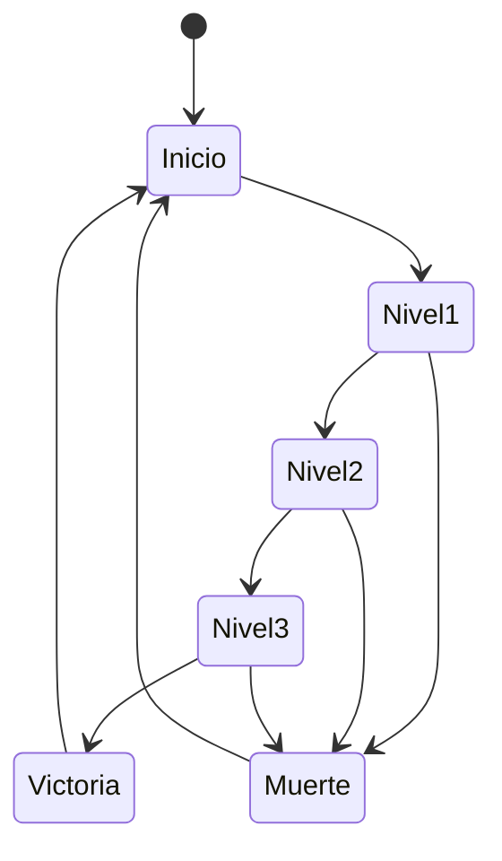
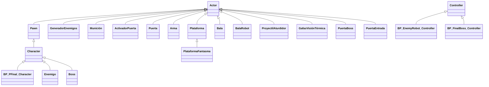

# Desarrollo de Videojuegos - Proyecto Final: 007 - Ultimate Agent

El proyecto consiste en desarrollar el prototipo ejecutable de un videojuego de plataformas, minipuzzles y disparos 3D para un sólo jugador.
Tiene elementos de parkour, retos mentales con puzzles y elementos tácticos como guardar cierto sigilo frente a los enemigos. El juego está fuertemente inspirado en la saga de James Bond.

## Instalación y uso
Todo el contenido del proyecto está disponible aquí en el repositorio, salvo las subcarpetas Starter Content, la plantilla Third Person, la biblioteca de Quixel Megascans, y recursos gratuitos del Unreal Engine Marketplace: Animation Starter Pack, Modular SciFi Season 1 Starter Bundle y Modular Scifi Season 2 Starter Bundle.
Estas subcarpetas deben incluirse en la carpeta Content. Si se tiene permiso, es posible [descargarlas aquí]().

## Preproducción
Para el proyecto final no había un enunciado que sirva como punto de partida. El diseño era uno libre y consistía en diseñar un juego que tenga algo nuevo que no hayamos visto en clase y usar cosas vistas en las practicas.

El juego planteado consiste en una misión del agente 007, en la que debe infiltrarse en una base enemiga para robar unos documentos secretos y matar al malvado tirano. Para ello, debe superar una serie de obstáculos, como saltar por plataformas, resolver puzzles, y eliminar a los enemigos que se encuentre por el camino. Para obtener los documentos debe enfrentarse al jefe final.


El diseño tiene estas secciones:
- [Estetica](#Estetica)
  * [Graficos](#Graficos)
  * [Sonidos](#Sonidos)
- [Dinamica](#Dinamica)
  * [Objetivo](#Objetivo)
  * [Castigo](#Castigo)
- [Contenido](#Contenido)
  * [Avatar](#Avatar)
  * [Enemigos](#Enemigos)
  * [Recargas de munición](#Recargas_de_munición)
  * [Activadores de puertas](#Activadores_de_puertas)
  * [Puertas](#Puertas)
  * [Arma](#Arma)
  * [Gafas térmicas](#Gafas_térmicas)
  * [Silenciador](#Silenciador)
  * [Plataformas](#Plataformas)
  * [Plataformas fantasma](#Plataformas)
  * [Balas](#Balas)
  * [Boss](#Boss)

- [Zonas](#Zonas)
  * [Escalada](#Escalada)
  * [Entrada](#Entrada)
  * [Laboratorio](#Laboratorio)


### Estetica
El juego usa el contenido de Starter Content, la plantilla Third Person, y algunos recursos gratuitos del Unreal Engine Marketplace: Animation Starter Pack, Modular SciFi Season 1 Starter Bundle, Stylized Character Kit: Casual 01 .
La estética será de ambientación futurista scifi y espias, cuidando la coherencia del escenario, el detalle y funcionamiento de los objetos interactivos.


#### Graficos
El juego usa el contenido de Starter Content, la plantilla Third Person, y dos recursos gratuitos del Unreal Engine Marketplace: Animation Starter Pack, Modular SciFi Season 1 Starter Bundle, Stylized Character Kit: Casual 01 .


#### Sonidos
No hay música ambiente.
Sonidos:
- Sonido de disparo.
- Sonido al obtener munición.
- Sonido al completar el puzzle y abrir la puerta.
- Sonido al matar al boss final.
- Sonido al recuperar vida.
- Sonido al coger arma.


### Dinamica
La dinámica del juego consiste en llegar escalar la montaña, infiltrarse en el laboratorio y matar al boss final sin morir.
La muerte supone volver a comenzar el juego. El final es cuando completas los tres niveles sin morir.




#### Objetivo
El objetivo del juego es completar los tres niveles sin morir y matar al boss final.


#### Castigo
El castigo del juego es la muerte del jugador.
Tambíen se pierde vida si le disparan los enemigos.


### Contenido

A continuación detallamos el contenido más importante del juego.

#### Avatar
El agente James Bond que se puede mover y saltar. Es el avatar que controla el jugador.


#### Enemigos
Son los enemigos que aparecen en cada nivel. Estos enemigos se activan al entrar al nivel y se destruyen al matarlos.
Estos patrullan por sus estancias y con su comportamiento inteligente son capaces de detectar (mediante percepción visual, si hay luz en la estancia, o sonora, si se hace algún ruido), perseguir y hasta disparar desde cierta distancia al protagonista, con el objetivo de causarle daño con sus proyectiles.


#### Recargas de munición
Son las recargas de munición que aparecen en cada nivel. Estas recargas aumentan la munición del jugador al recogerlas.


#### Activadores de puertas
Nos permite abrir unas puertas y entrar al nivel. Para abrir las puertas hay que resolver un puzzle.

#### Puertas
Las puertas se abren al resolver el puzzle.

#### Arma
Es el arma que usa el jugador para matar a los enemigos. Hace ruido al disparar.

#### Gafas térmicas
Cuando se activan las gafas térmicas se ve a los enemigos a través de las paredes.

#### Silenciador 
Cuando se activa el silenciador el arma no hace ruido al disparar, pero tienes que dar dos disparos para matar a los enemigos.

#### Plataformas
Son las plataformas que estan fuera y nos permite escalar para llegar al laboratorio.

#### Plataformas fantasma
Son las plataformas que estan fuera y estan mezcladas con la otras plataformas. Sin embargo estas son trampa y el jugador las atraviesa.

#### Balas
Son las balas que usa el jugador para matar a los enemigos. Se recargan al coger las recargas de munición.

#### Boss
Es el boss final que aparece en el final del juego. Este boss aparece al final de la zona de laboratorio y se destruye al matarlo. Este boss tiene un comportamiento inteligente y es capaz de detectar (mediante percepción visual, si hay luz en la estancia, o sonora, si se hace algún ruido), perseguir y  disparar desde cierta distancia al protagonista, con el objetivo de causarle daño con sus proyectiles. Tiene un comportamiento superior al de los enemigos normales.


### Zonas

#### Escalada
Esta zona consiste en escalar unas paredes con plataformas. Algunas son falsas y no son sólidas, no puedes apoyarte en ellas.
En esta zona hay 2 zonas intermedias de descanso de tal forma que una vez superadas no tienes que repetir toda la escalada, solamente la ultima zona no superada.

```mermaid
graph LR;
    iniAvatar[Inicio del agente]-->plataformas1[Primera escalada];
    plataformas1[Primera escalada]-->descansoPlataforma1[Primera zona intermedia de descanso];
    descansoPlataforma1[Primera zona intermedia de descanso]-->plataformas2[Segunda escalada];
    plataformas2[Segunda escalada]-->descansoPlataforma2[Segunda zona intermedia de descanso];
    descansoPlataforma2[Segunda zona intermedia de descanso]-->plataformas3[Tercera escalada]; 
    plataformas3[Tercera escalada]-->finPlataformas[Entrada del laboratorio];
```



#### Entrada
Esta zona consiste en entrar en el laboratorio. Para ello hay que resolver unos puzzle para abrir las puertas. 
Hay que resolver 2 puzzles para abrir las 2 puertas. Cada puzzle se resuelve moviendo una caja por un laberinto, simulando que es un circuito eléctrico.
 
```mermaid
entrada[Entrada del laboratorio] --> puzzle1[Primer puzzle];
puzzle1[Primer puzzle] --> antesala[Antesala del laboratorio];
antesala[Antesala del laboratorio]--> puzzle2[Segundo puzzle];
puzzle2[Segundo puzzle] --> finEntrada[Laboratorio];
```

#### Laboratorio
Esta zona consiste en infiltrarse en el laboratorio de la manera más sigilosa posible y matar al boss final.

```mermaid
finEntrada[Laboratorio] --> infiltrarse[Infiltrarse en el laboratorio];
infiltrarse[Infiltrarse en el laboratorio] --> matar[Matar enemigos];
matar[Matar enemigos] --> boss[Matar Boss final];
boss[Boss final] --> finAvatar[Fin del juego];
```


## Producción

Las clases principales que se han desarrollados son las siguientes.



## Video
El link del video con las pruebas es el siguiente: (https://youtu.be/o5_CBEaBRCg)  .


## Tareas
Las tareas que se han realizado para la práctica las encontramos en el siguiente link de github:(https://github.com/DEV23-G01/DEV23-Bugoi/commits/main/)


## Licencia

David Bugoi, autor de la documentación, código y recursos de este trabajo, concedo permiso permanente a los profesores de la Facultad de Informática de la Universidad Complutense de Madrid para utilizar mi material, con sus comentarios y evaluaciones, con fines educativos o de investigación; ya sea para obtener datos agregados de forma anónima como para utilizarlo total o parcialmente reconociendo expresamente mi autoría.

Una vez superada con éxito la asignatura se prevee publicar todo en abierto (la documentación con licencia Creative Commons Attribution 4.0 International (CC BY 4.0) y el código con licencia GNU Lesser General Public License 3.0).

## Referencias

Practicas anteriormente realizadas en la asignatura de Desarrollo de Videojuegos.

James Bond

Metal Gear Solid (Konami, 1998)

Wolfenstein 3D (id Software, 1992)

Fall Guys (Mediatonic, 2020)

